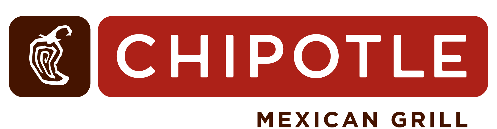
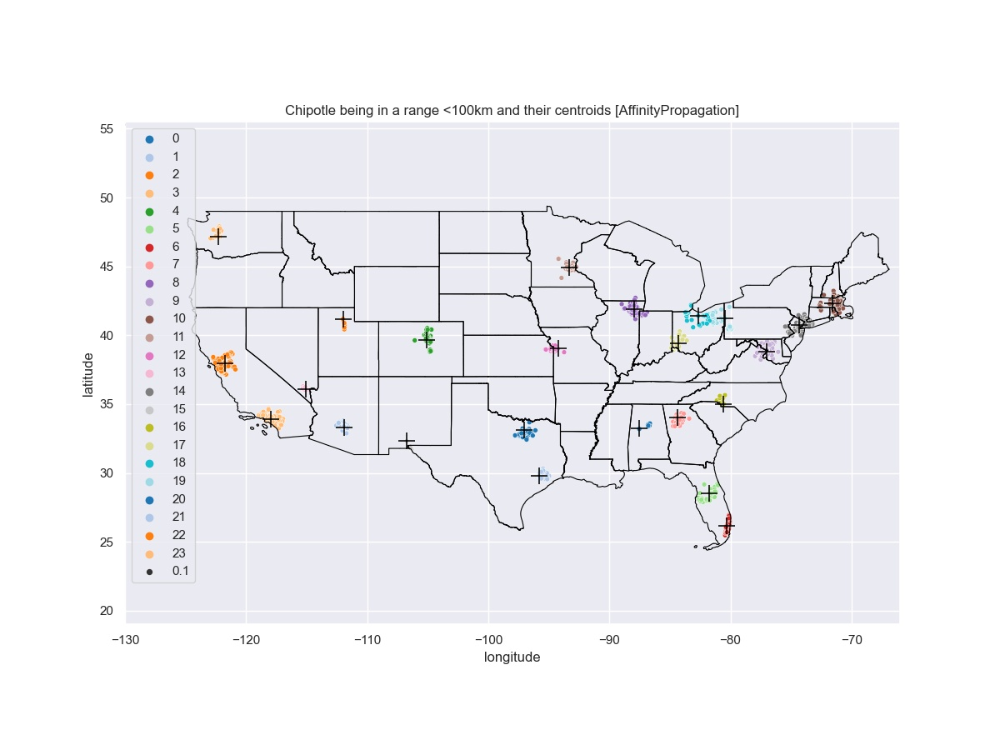

# Chipotle clustering challenge

### The Dream Team
- [Christian Melot](https://github.com/Ezamey), junior AI developer
- [Jérôme Coumont](https://github.com/jcoumont), junior AI developer
- [Ebubekir Kocadag](https://github.com/EbubekirKocadag), junior AI developer

## The Mission

>
>"Honey, where do you wanna eat?"
>
>"Do you even have to ask? Chipotle, of course!"
>
>"How could I forget, we've been eating Chipotle for the last 47 days..."
>
>"So get ready for number 48! Oh I can't wait to stuff my face with a burrito!"
>
>"But the closest one is an hour drive away, couldn't we just get McDonalds?"
>
>"How dare you utter that word in my presence? First the neighbors, now you!"
>
>"The neighbors? What do they have to d-"
>
>"That's it, we're moving, I can't deal with this anti-Chipotle fascism."

Find Chipotle **epicentres** to live your ideal Chipotle lifestyle by clustering the [Chipotle dataset](chipotle_locations.csv).
### Must-have features

- [X] A visualization of the USA with Chipotle locations
- [X] Visualization of the different clusters
- [X] Intrinsic analysis comparison of the clusters of at least 2 methods with varying arguments (using Euclidean distance as criteria)
- [X] A chosen centroid to live. Make your argument of why the chosen centroid is superior to others. Examples of arguments are:
    - [X] highest density
    - [X] greatest uninterrupted link of Chipotle locations with smallest link-to-link distance
    - [X] ...
- [X] a GitHub page where results are visualized

### Nice-to-have features

- [X] Color coded cluster visualization
- [X] Clear graph legends

## Description
If you want play golf with your best friend choose this location in Floride

### Algorithms' comparison

#### Kmeans

#### DBSCAN

#### Optics

#### Agglomerative

#### BIRCH

#### Gaussian mixture

#### Affinity propagation

## Usage

The content of the analysis is available into the different jupyter notebooks. (They use different clustering algorithms)
## Installation

The needed libraries are in the requirement.txt. To install it, use the command below:
`python -m pip install -r requirements.txt`
To be able to access to the work, you have to install jupyter notebook. You have more information in [this website](https://jupyter.org/) and you can install it with this command:
`pip install jupyterlab`

Links to the official documentation of libraries :
[haversine](https://pypi.org/project/haversine/)
[geopandas](https://geopandas.org/)
[matplotlib.pyplot](https://matplotlib.org/tutorials/introductory/pyplot.html)
[numpy](https://numpy.org/doc/stable/)
[pandas](https://pandas.pydata.org/docs/)
[seaborn](https://seaborn.pydata.org/tutorial.html)
[sklearn.cluster](https://scikit-learn.org/stable/modules/clustering.html)

## Proposition

We use 2 differents clustering models to give you the best place to have chipotle every days and every years.

#### First clustering model

You can choose between:

#### Second clustering model

You can choose between:

#### Third clustering model

_Nice and Cosy in New Jersey_:

_Hardcore_:

Not really a good location  but if [needed](https://www.decathlon.be/fr/browse/c0-tous-les-sports/c1-camping/c3-tentes-pop-up/_/N-mf86su) so you can leave your Chipotle dream life.